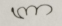

# Machine Learning for Cambara
The Cambara application uses the application of Machine Learning to classify Aksara Bali images, using the Convolutional Neural Network (CNN) model.

## Library
- Numpy
- Tensorflow
- Cv2
- Keras
- Os
- Matplotlib
- Shutil
- Sklearn

## Example Dataset
| Ha       | Na     | Ca       | Ra     | Ka       | Da     |
|--------------|-----------------|--------------|-----------------|--------------|-----------------|
|  |  |  |  |  |  |

| Ta       | Sa     | Wa       | La     | Ma       | Ga     |
|--------------|-----------------|--------------|-----------------|--------------|-----------------|
|  |  |  |  |  |  |

| Ba       | Nga     | Pa       | Ja     | Ya       | Nya     |
|--------------|-----------------|--------------|-----------------|--------------|-----------------|
|  |  |  |  |  |  |

## Contributors
1. M298BSY0034 – Putu Gio Satria Adinata – Universitas Pendidikan Ganesha
2. M502BSY1366 – I Putu Gede Suma Wijaya – Institut Bisnis dan Teknologi Indonesia
3. M502BSY1585 – I Putu Gede Suangga Wijanatha – Institut Bisnis dan Teknologi Indonesia
